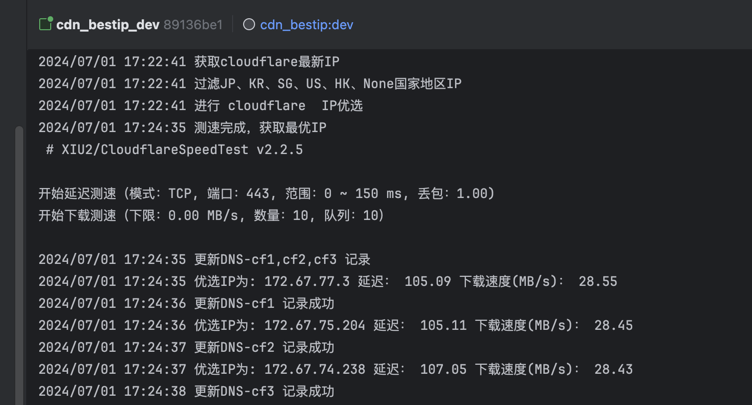
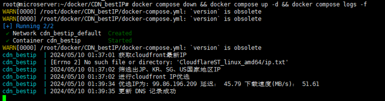

# CDN_bestIP
[](https://github.com/Qetesh/CDN_bestIP/actions/workflows/docker-image.yml)

[中文版本](README.md) | [English Version](README_EN.md)

CDN_bestIP 是一个使用 Python 编写的项目，自动获取 CDN 平台最新 IP，**于当前网络下对 CDN 优选**，排除大陆IP，获取最快IP。并自动更新域名解析，优化当前网络下 CDN 的网络质量。

该项目使用 [CloudflareSpeedTest](https://dithub.com/XIU2/CloudflareSpeedTest) 项目来进行IP测速。
> 更新：2024/6 大陆区域使用aws cloudfront限速2Mbps左右
## 功能

- 自动获取所有 CDN 最新地址库（使用maxmind地址库排除大陆IP地址段，筛选地区'JP', 'KR', 'SG', 'US', 'HK', None）
- **使用当前网络对 IP 地址进行速度测试**
- 更新 DNS 记录，可使用多个记录，通过轮询或本地测速方式，实现带宽叠加或备份
- 定期更新记录，默认为2天运行一次
- **可使用自建服务器，指定测速链接，`stURL` 变量设置自定义 url 测速**
设置系统环境变量

> stUrl（可选，可通过`dd if=/dev/zero of=100MB.test bs=1M count=100`在网站根目录生成测试文件）
> 
> 测试Url连接为:`https://xx.xx.net/100MB.test`
> 
> 如服务测速信息与cloudflare配置如下：
> 
> 域名为:`cdn.example.com`
> 
> cloudflare 邮箱地址为:`admin@exmple.com`
> 
> Global API Key:`ccccccccccccccccccccccccccccccc`
---
> Dnspod 使用token更新记录
> 
> dns_api_key=token id,token;
> 
> 如：dns_api_key='xxxxx,yyyyyyyyyyyyyyyyyyy'


---
> CloudflareSpeedTest构建方式：`export GOOS=linux && export GOARCH=amd64 && go build -o ..
/CloudflareST_linux_amd64/CloudflareST -ldflags "-s -w"`
---

## 使用方法- Docker 环境
> docker安装  https://docs.docker.com/engine/install/
> 
> docker compose安装 https://docs.docker.com/compose/install/
```
docker run -d --name ghcr.io/qetesh/cdn_bestip:latest \
  --restart always \
  -e cdn_provider='cloudflare' \
  -e dns_provider='dnspod' \
  -e domain='example.com' \
  -e record_name='cdn1,cdn2' \
  -e dns_api_key='xxxxx,yyyyyyyyyyyyyyyyyyy' \
  -e email='xx@exmple.com' \
  -e stUrl='https://xx.xx.net/100MB.test' \
  cdn_bestip
```

使用 Docker Compose 运行，可参考[docker-compose.yml](docker-compose.yml)。需先设置`.env`文件：
.env
```shell
cdn_provider = 'cloudflare'
dns_provider = 'dnspod'
domain = 'example.com'
record_name = 'cdn1,cdn2'
dns_api_key = 'xxxxx,yyyyyyyyyyyyyyyyyyy'
email = 'xx@exmple.com'
stUrl = 'https://xx.xx.net/100MB.test'
```

```shell
docker compose up -d
```

<details>
  <summary>Docker 本地构建运行</summary>
该项目可以在 Docker 环境中运行。你可以使用提供的 Dockerfile 构建镜像，并通过 Docker 或 Docker Compose 运行。

首先，使用以下命令构建 Docker 镜像：

```shell
docker build -t cdn_bestip .
```

然后，运行容器（stUrl参数可选）：

```shell
docker run -d --name ghcr.io/qetesh/cdn_bestip:latest \
  --restart always \
  -e cdn_provider='cloudflare' \
  -e dns_provider='dnspod' \
  -e domain='example.com' \
  -e record_name='cdn1,cdn2' \
  -e dns_api_key='xxxxx,yyyyyyyyyyyyyyyyyyy' \
  -e email='xx@exmple.com' \
  -e stUrl='https://xx.xx.net/100MB.test' \
  cdn_bestip
```

或者，使用 Docker Compose 运行，需先设置`.env`文件：

.env
```shell
cdn_provider = 'cloudflare'
dns_provider = 'dnspod'
domain = 'example.com'
record_name = 'cdn1,cdn2'
dns_api_key = 'xxxxx,yyyyyyyyyyyyyyyyyyy'
email = 'xx@exmple.com'
stUrl = 'https://xx.xx.net/100MB.test'
```

```shell
docker compose build
docker compose up -d
```
</details>

<details>
  <summary>使用方法-本地运行</summary>
## 使用方法-本地运行

### 1. 克隆项目

使用以下命令克隆项目到本地：

```shell
git clone https://github.com/qetesh/CDN_bestIP.git
```
### 2. 安装依赖

安装python3、pip3：
```shell
apt install python3 python3-pip
```
进入项目目录，并安装所需的 Python 依赖：

```shell
cd CDN_bestIP
pip3 install -r requirements.txt
```

### 3. 配置 Cloudflare API

环境变量设置的值对应如下：
```plaintext
export domain='example.com' .....
```

确保替换上述值为你自己的 Cloudflare 域名、A记录域名、Global API Key 、邮箱地址、测速URL（可选）。

### 4. 运行项目

运行以下命令启动项目（默认将一直保持前台运行，可使用`nohup python3 main.py &`保持后台运行）：

```shell
python3 main.py
```
</details>

---


## Todo
### CDN
- [x] aws CloudFront
- [x] CloudFlare
### DNS服务商
- [x] 最多添加最快的三个IP
- [x] CloudFlare
- [x] DNSPod

## 贡献

欢迎贡献代码、报告问题或提出改进建议。请在 GitHub 上提交 Issue 或 Pull Request。

## 致谢

- https://github.com/XIU2/CloudflareSpeedTest
- https://www.maxmind.com

## 许可证

本项目基于 MIT 许可证。有关详细信息，请参阅 [LICENSE](LICENSE) 文件。

## 免责声明

本项目仅供学习和参考，使用本项目所产生的一切后果由使用者自行承担。请谨慎使用，并遵守相关法律法规和服务提供商的条款。

