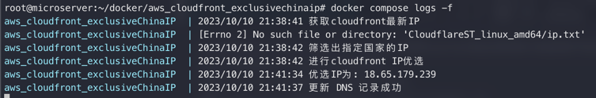

# AWS CloudFront AutoUpdate

[中文版本](README.md) | [English Version](README_EN.md)

AWS CloudFront AutoUpdate 是一个使用 Python 编写的项目，旨在通过[官方链接](https://d7uri8nf7uskq.cloudfront.net/tools/list-cloudfront-ips)实现自动获取 AWS CloudFront 的所有 IP 地址，并根据当前网络对其进行CloudFront优选，获取最快IP。后通过 Cloudflare 更新域名解析，优化当前网络下CloudFront的网络优化。

该项目使用 [CloudflareSpeedTest](https://github.com/XIU2/CloudflareSpeedTest) 项目来进行IP测速。

## 功能

- 自动获取所有 AWS CloudFront IP 地址（使用maxmind地址库排除大陆备案IP地址段，测速IP包含'JP', 'KR', 'SG', 'US'）。
- 基于当前网络对 IP 地址进行速度测试。
- 更新 Cloudflare 域名解析为最快的 IP 地址。
- 通过 python cron 定期自动更新记录，默认为三天运行一次
- **可使用自建服务器，指定测速链接，`stURL` 变量设置自定义 url 测速**

---

## 使用方法- Docker 环境

该项目可以在 Docker 环境中运行。你可以使用提供的 Dockerfile 构建镜像，并通过 Docker 或 Docker Compose 运行。

首先，使用以下命令构建 Docker 镜像：

```shell
docker build -t cloudfront_autoupdate .
```

然后，运行容器：

```shell
docker run -d --name awsCloudFront_AutoUpdate \
  --restart always \
  -e domain='xxx.com' \
  -e record_name='xxx' \
  -e api_key='xxx' \
  -e email='xxx' \
  cloudfront_autoupdate
```

或者，使用 Docker Compose 运行，需先设置`.env`文件：

.env
```shell
domain = 'xxx.com'
record_name = 'xxx'
api_key = 'xxx'
email = 'xxx'
```

```shell
docker compose up -d
```
---

## 使用方法-本地运行

### 1. 克隆项目

使用以下命令克隆项目到本地：

```shell
git clone https://github.com/qetesh/awsCloudFront_AutoUpdate.git
```

### 2. 安装依赖

进入项目目录，并安装所需的 Python 依赖：

```shell
cd awsCloudFront_AutoUpdate
pip3 install -r requirements.txt
```

### 3. 配置 Cloudflare API

设置系统环境变量

```plaintext
domain = 'xxx.com'
record_name = 'xxx'
api_key = 'xxx'
email = 'xxx'
stUrl = 'xxx'（可选）
```

确保替换上述值为你自己的 Cloudflare 域名、A记录域名、Global API Key 、邮箱地址、测速URL（可选）。

### 4. 运行项目

运行以下命令启动项目（默认将一直保持运行，可使用nohup &保持后台运行）：

```shell
python3 main.py
```

---

## 贡献

欢迎贡献代码、报告问题或提出改进建议。请在 GitHub 上提交 Issue 或 Pull Request。

## 许可证

本项目基于 MIT 许可证。有关详细信息，请参阅 [LICENSE](LICENSE) 文件。

## 免责声明

本项目仅供学习和参考，使用本项目所产生的一切后果由使用者自行承担。请谨慎使用，并遵守相关法律法规和服务提供商的条款。

